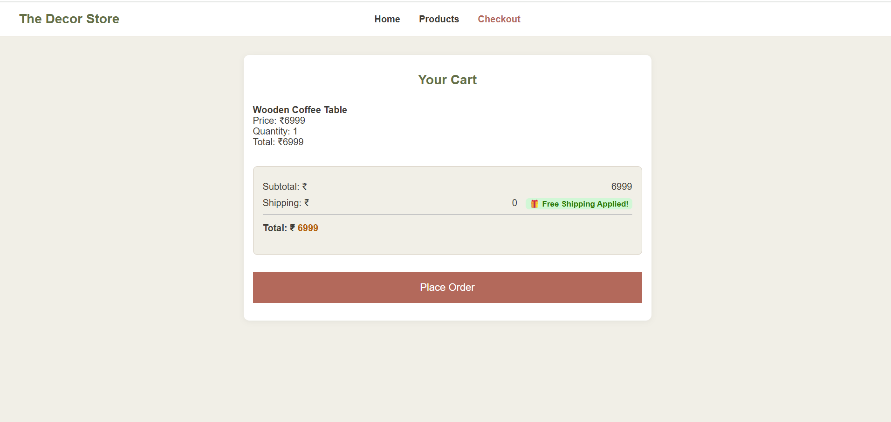
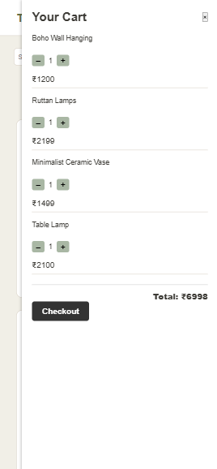
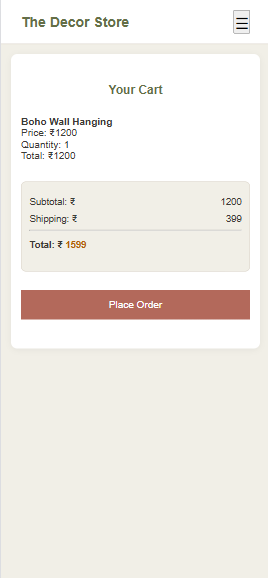

# task-9

**The Decor Store – Functional Checkout Page**
A responsive and interactive checkout page built using HTML, CSS, and JavaScript. This page dynamically displays items added to the cart, calculates the subtotal and final total, allows item removal, and includes a simulated "Place Order" confirmation experience. The design ensures a user-friendly shopping summary for both desktop and mobile users.

---

# Live Demo

[🔗 View Live]()

---

# Screenshots

### Desktop View

### Mobile View

---

